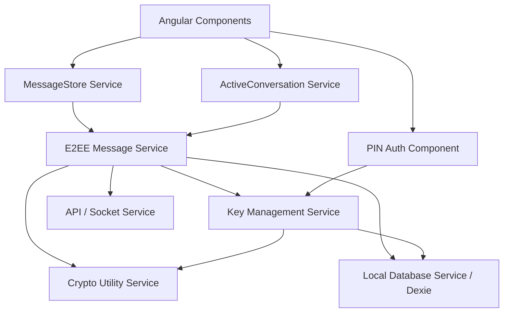

# Client-Side E2EE Implementation Plan - ChatApps_Pigeons

## 1. Architectural Overview

Để triển khai E2EE phía Client một cách clean và maintainable, chúng ta cần tách biệt rõ ràng giữa logic mã hóa (Cryptography), lưu trữ cục bộ (Local Storage), quản lý khóa (Key Management), và tích hợp vào luồng tin nhắn hiện tại (Message Pipeline). Việc này giúp các service hiện tại như `messageStore.service.ts` hay `activeConversation.service.ts` không bị phình to và rối rắm.

Dưới đây là sơ đồ kiến trúc các Service mới sẽ được thêm vào hệ thống Angular:

---

## 2. Phân chia các Service mới (New Services)

Để đảm bảo Single Responsibility Principle (SRP), chúng ta sẽ tạo các service sau trong `client/src/app/services/e2ee/`:

### 2.1. `CryptoUtilityService` (`cryptoUtility.service.ts`)
Chịu trách nhiệm hoàn toàn về các phép toán mã hóa sử dụng `Web Crypto API`. Đây là một service thuần túy (pure functions), không chứa state.
- **Nhiệm vụ**:
  - `generateIdentityKeyPair()`: Tạo cặp khóa RSA-OAEP.
  - `generateSharedKey()`: Tạo khóa AES-GCM (256-bit).
  - `deriveKEKFromPIN(pin, salt)`: Dùng PBKDF2 biến PIN thành KEK (Salt: 16 byte).
  - `wrapKey() / unwrapKey()`: Bọc/mở khóa private key (bằng KEK) và shared_key (bằng RSA public key).
  - `encryptData() / decryptData()`: Mã hóa/giải mã nội dung tin nhắn AES-GCM (IV: 12 byte).
  - Chuyển đổi format (ArrayBuffer ↔ Base64 ↔ String).

### 2.2. `LocalDatabaseService` (`localDatabase.service.ts`)
Tích hợp **Dexie.js** để quản lý IndexedDB theo mô hình Dynamic Database (`pigeons_db_{user_id}`).
- **Nhiệm vụ**:
  - Khởi tạo kết nối db: `initDb(userId)`.
  - CRUD `own_keys`: Lưu/lấy Identity Keys của user hiện tại.
  - CRUD `conversation_keys`: Lưu/lấy các `shared_key` đã được unwrap.
  - CRUD `messages`: Lưu tin nhắn plaintext, truy vấn tin nhắn theo `conversation_id` kết hợp pagination (thay thế một phần việc lưu trữ in-memory trong `messageStore`).

### 2.3. `KeyManagementService` (`keyManagement.service.ts`)
Quản lý luồng nghiệp vụ của Khóa và Vault (phối hợp giữa API Server, LocalDB và CryptoUtility).
- **Nhiệm vụ**:
  - `setupNewDevice(pin)`: Gọi Crypto để tạo RSA keypair, tạo KEK từ PIN, wrap private key, gọi API đẩy lên server, lưu vào LocalDB.
  - `recoverDevice(pin)`: Lấy wrapped private key từ server, dùng PIN mở khóa, lưu vào LocalDB, tải toàn bộ `ConversationKeysVault` từ server về unwrap và lưu vào `conversation_keys` table.
  - `getSharedKey(conversationId, keyVersion)`: Lấy `shared_key` từ in-memory cache hoặc LocalDB. Nếu không có, gọi API tải vault entry về, unwrap và lưu cache.
  - `rotateSharedKey(conversationId, participants)`: Tạo `shared_key` version mới, wrap cho từng participant public key và gọi API upload vault.

### 2.4. `E2EEMessageService` (`e2eeMessage.service.ts`)
Lớp cầu nối (Facade) giữa UI/MessageStore và hệ thống E2EE.
- **Nhiệm vụ**:
  - **Gửi tin nhắn (`encryptAndSend`)**: Nhận plaintext từ UI -> Xin `shared_key` từ `KeyMgmt` -> Dùng `CryptoUtility` mã hóa AES-GCM -> Lưu plaintext vào `LocalDB` -> Gọi `socket.ts`/`messages.ts` gửi ciphertext lên server.
  - **Nhận tin nhắn (`decryptAndStore`)**: Nhận ciphertext từ Socket -> Xin `shared_key` từ `KeyMgmt` -> Dùng `CryptoUtility` giải mã -> Lưu plaintext vào `LocalDB` -> Emit event báo `MessageStore` update UI.
  - **Đồng bộ lịch sử (`syncHistory`)**: Fetch missed messages từ API -> Giải mã hàng loạt -> Cập nhật LocalDB.

---

## 3. Chỉnh sửa các Service hiện tại (Modifications)

### 3.1. `authService.ts`
- Sau khi Login thành công, gọi `LocalDatabaseService.initDb(userId)`.
- Kiểm tra xem thiết bị này đã có Private Key trong IndexedDB chưa. Nếu chưa -> Chuyển hướng user đến màn hình "Nhập mã PIN để đồng bộ tin nhắn".

### 3.2. `socket.ts`
- Khi nhận sự kiện `new_message`, thay vì push thẳng vào `MessageStore`, đẩy payload sang `E2EEMessageService.decryptAndStore(payload)`.

### 3.3. `messageStore.service.ts` & `activeConversation.service.ts`
- Thay vì fetch lịch sử tin nhắn trực tiếp từ API server, store sẽ fetch từ `LocalDatabaseService` (IndexedDB).
- Nếu LocalDB thiếu dữ liệu, gọi `E2EEMessageService.syncHistory()` để kéo từ API về, giải mã rồi mới load lên store.
- Thay vì gọi API post message, store gọi `E2EEMessageService.encryptAndSend()`.

---

## 4. Kế hoạch triển khai (Implementation Plan)

Nên triển khai theo các bước độc lập (Iterative steps) để dễ debug:

### Phase 1: Core Foundation (Thuần Local)
1. Cài đặt **Dexie.js**.
2. Viết `CryptoUtilityService`: Implement và Unit Test tất cả các hàm mã hóa (Web Crypto API).
3. Viết `LocalDatabaseService`: Tạo schema và các hàm CRUD cơ bản. Test lưu trữ ArrayBuffer/CryptoKey vào IndexedDB.

### Phase 2: Key & Identity Flow (Tích hợp API User/Vault)
1. Tạo UI Component: **PIN Setup / Recovery Modal**.
2. Viết `KeyManagementService`: 
   - Tích hợp flow tạo Identity Keys -> Wrap Private Key -> Gọi API update user.
   - Flow nhập mã PIN -> Lấy Wrapped Private Key -> Unwrap -> Lưu LocalDB.
3. Test việc tạo và đồng bộ Private Key giữa 2 trình duyệt (coi như 2 device).

### Phase 3: Pipeline mã hóa tin nhắn (Tích hợp Socket & Message API)
1. Viết `E2EEMessageService`.
2. Sửa luồng gửi tin nhắn: Giao diện Chat -> Sinh/Lấy Shared Key -> Mã hóa -> Push qua Socket.
3. Sửa luồng nhận tin nhắn: Socket nhận Ciphertext -> Lấy Shared Key -> Giải mã -> Lưu Dexie.
4. Test chat 1-1 real-time với ciphertext bay qua Network Tab, nhưng hiển thị plaintext trên UI.

### Phase 4: History Sync & Optimistic UI
1. Chỉnh sửa `messageStore.service.ts` để đọc từ Dexie.js thay vì state memory.
2. Viết logic Pagination cho Dexie (load thêm khi scroll top).
3. Hoàn thiện flow "Missed Messages": Khi bật lại app, kéo các tin nhắn trong lúc offline về, giải mã và merge vào Dexie.

### Phase 5: Group Chat Key Rotation (Winner-takes-all)
1. Thêm logic khi có member mới join/leave group.
2. Client kích hoạt `rotateSharedKey` (tăng key_version).
3. Xử lý UI hiển thị "Key changed" và test việc thành viên mới không đọc được tin nhắn cũ (nếu history=OFF).
